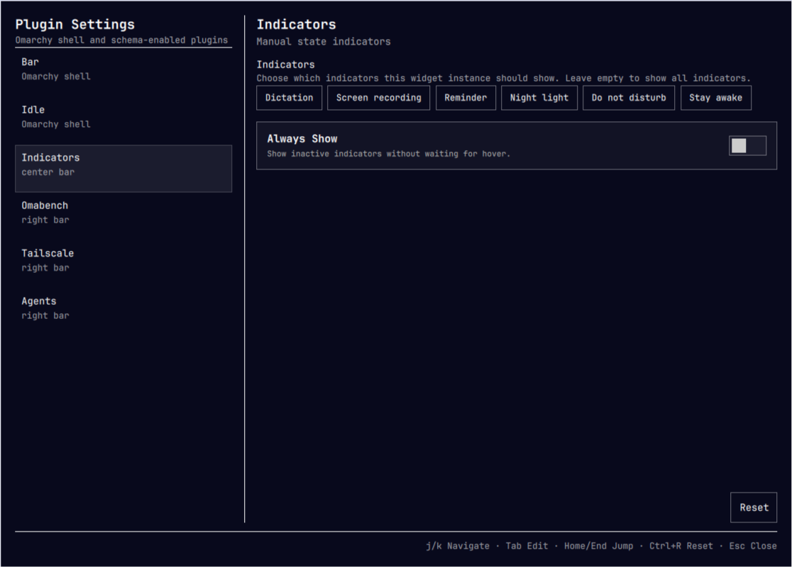

# Plugin Settings

Schema-driven settings editor for the Omarchy shell and its plugins. It adds a
gear button to the bar that opens a settings window where shell settings and
supported plugin instances can be configured.



## Features

- Provides forms for Omarchy bar appearance and idle timeouts.
- Lists enabled bar-widget instances, regular plugins, and the active full bar
  when they declare a supported manifest schema.
- Writes changes only to the selected item in `~/.config/omarchy/shell.json`.
- Renders `string`, `path`, `integer`, `number`, `boolean`, `enum`, and
  `multiselect` fields.
- Enforces numeric `min`, `max`, and `step` constraints.
- Uses switches for booleans and two-option `Off` / `On` enums.
- Provides Reset-to-defaults, dirty-state feedback, and a Save action.

## Interactions

- Bar gear: toggle the settings window.
- Window close button: close the window.
- `Escape`: close the window.
- `Ctrl+S`: save pending changes.
- `Ctrl+R`: reset the selected item to its defaults.
- `Ctrl+W`: close the window.
- `Up` / `Down`, `Home` / `End`: navigate the item list when it is focused.
- `Ctrl+1` through `Ctrl+9`: select the corresponding item in the list.
- `Tab` / `Shift+Tab`: move between interactive controls; `Enter` or `Space`:
  activate the focused control.
- `Up` / `Down` in a numeric field: adjust by its configured step (or 1).
- `Page Up` / `Page Down`: scroll the settings form.
- `?`: show or hide the in-window keyboard shortcut reference.

## Install

Install it with Omarchy's plugin manager:

```bash
omarchy plugin add https://github.com/mokkabonna/omarchy-plugin-settings.git
omarchy plugin enable mokkabonna.plugin-settings --section right
```

Omarchy plugins run as unsandboxed code inside the shell. Review a plugin's
source before enabling it.

## Development

For a local checkout, link it into the user plugin directory, rescan, and
enable it:

```bash
ln -s "$(pwd)" ~/.config/omarchy/plugins/mokkabonna.plugin-settings
omarchy-shell shell rescanPlugins
omarchy plugin enable mokkabonna.plugin-settings --section right
```

Omarchy automatically reloads changes made directly under its plugin
directory. Its watcher does not follow this development symlink, so reload
QML changes with `omarchy restart shell`; use `omarchy-shell shell
rescanPlugins` after changing the manifest.

Run the local checks before committing:

```bash
make check
```

To run the GitHub Actions check workflow locally, install
[nektos/act](https://nektosact.com/installation/) and ensure Docker is
running, then use:

```bash
make act
```

## Scope

The built-in Bar and Idle forms patch their corresponding top-level sections
without replacing layout or other unknown values. Reset reads Omarchy's live
default configuration rather than hardcoding values.

Bar widgets use Omarchy's existing `barWidget.schema` and `barWidget.defaults`
fields. Other plugin kinds use this plugin's lightweight `settings` convention:

```json
"settings": {
  "displayName": "My Plugin",
  "defaults": { "enabled": true },
  "schema": [
    { "key": "enabled", "type": "boolean", "label": "Enabled" }
  ]
}
```

The convention applies to `panel`, `overlay`, `menu`, and `service` plugins;
their values are saved to the matching entry in `plugins[]`. For a full `bar`
plugin, values are saved to the active `bar` entry. The form format is flat:
nested values and plugin-owned `settingsForm` UIs are not rendered.
